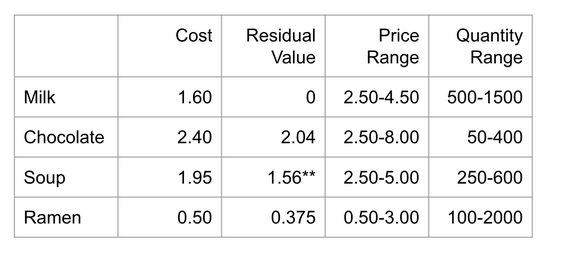

Source of the [puzzle](https://www.linkedin.com/pulse/integrating-ml-meinolf-sellmann-qr1ze/)

# Description

Nook & Nibble is the chain of cozy convenience stores in DS City. They need to set prices for their products as well as decide how much of each to order. Thankfully, they have extensive price-demand data for you to mine. Can you help?

Concretely, we have four products: milk, chocolate, soup, and ramen. Each product has a per-unit order cost, a residual value if not sold in this period, an allowed price range, and a minimum and maximum quantity that we can put on the shelves.

**A complication arises from the fact that the first 200 units of soup will expire and have no residual value if not sold in this period. Only units above 200 will retain a value of $1.56 in the next period. 